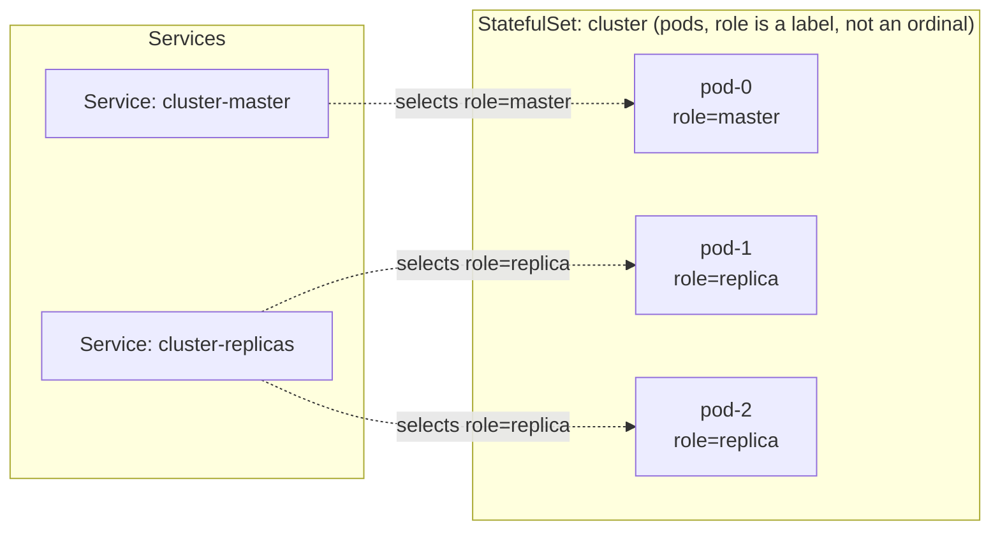
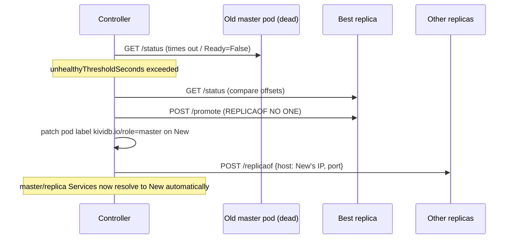

# Architecture

kividb-operator manages `KividbCluster` custom resources: each one is a
single-master, N-replica [kividb](https://kividb.io)
cluster (kividb is a Redis-RESP-compatible store). This document explains
the design decisions behind the operator and walks through exactly what
happens during reconciliation, failover, and backup.

## Five CRDs, not one

A `KividbCluster` does not embed its configuration, ACL users, or backup
settings directly. Those live in three separate, reusable kinds —
`KividbConfig`, `KividbAclConfig`, `KividbSnapshotConfig` — that a cluster
references by name (`spec.configRef`, `spec.aclConfigRef`,
`spec.snapshotConfigRef`). A fourth kind, `KividbSnapshot`, is a
read-only record the operator creates per backup run. See
[CONFIGURATION.md](CONFIGURATION.md) for the full field reference on all
five.

This split exists so that:

- Tuning/ACL/backup configuration can be shared across clusters (e.g. one
  `KividbSnapshotConfig` pointing at a shared S3 bucket, referenced by
  several `KividbCluster`s) without copy-pasting the same block into every
  cluster's spec.
- The operator never has to own a ConfigMap or Secret that *you* also feel
  the need to hand-edit — `KividbConfig`/`KividbAclConfig` are the actual
  user-facing objects; the ConfigMap/Secret the operator renders from them
  are pure implementation detail.
- Each kind's schema can evolve independently. Adding a new S3 provider
  quirk to `KividbSnapshotConfig`, for instance, doesn't touch
  `KividbCluster`'s schema at all.

## Why an agent sidecar?

kividb speaks only the RESP protocol on a single TCP port. It has:

- no HTTP health or metrics endpoint,
- no built-in object-storage upload for snapshots,
- and no `dir`/`dbfilename` config directive — `dump.kdb` and
  `appendonly.aof` are always written relative to the process's *current
  working directory*.

A Kubernetes controller cannot cheaply speak RESP itself for routine probe
traffic, cannot easily run `tar`+S3-upload logic inside the kividb
container image (which ships only the `kividb` binary), and Kubernetes
probes need HTTP/TCP/exec, not an arbitrary binary protocol.

So every kividb pod runs two containers, plus a third when metrics are
requested:

| Container | Image | Role |
|---|---|---|
| `kividb` | `spec.image`, or a floating default tag if unset | The database itself. `workingDir: /data`, `--configfile /etc/kividb/kividb.conf`. |
| `agent`  | `spec.agentImage` (defaults to the operator's own agent image) | A small Go HTTP sidecar (`cmd/agent`) that translates HTTP calls from the controller into RESP commands against `127.0.0.1:<port>`, and owns all S3 backup logic. |
| `redis-exporter` | `spec.exporterImage` (defaults to `oliver006/redis_exporter`), only when `spec.monitoring.enabled: true` | The de facto standard Prometheus exporter for Redis-protocol stores, scraped separately from the agent's own lightweight `/metrics` -- see [CONFIGURATION.md](CONFIGURATION.md#monitoring). |

The `kividb` and `agent` containers mount the same `data`
PersistentVolumeClaim at `/data`, so the agent can read/tar the snapshot
files kividb writes without any network hop. `redis-exporter` talks to
kividb purely over the network (`127.0.0.1:<port>`, same as any Redis
client) and mounts nothing.

The agent's HTTP contract (`internal/agentapi/types.go`) is intentionally
tiny:

```
GET  /healthz     liveness  (process up; never touches kividb)
GET  /readyz      readiness (real RESP PING; gates Service membership)
GET  /status      {role, connected, masterHost, masterPort, replicationOffset, lastSaveUnix, aofEnabled}
POST /promote     REPLICAOF NO ONE
POST /replicaof   {host, port}  ->  REPLICAOF host port
POST /acl/reload  ACL LOAD
POST /backup      BGSAVE, wait, tar.gz, upload to S3, prune old backups
GET  /metrics     Prometheus text exposition, derived from INFO
```

The controller never speaks RESP directly — it only calls this HTTP API,
once per pod per reconcile.

## Role assignment: labels, not ordinals

A naive design ties "master" to StatefulSet ordinal 0. That falls apart the
moment ordinal 0 fails and a replica has to take over permanently (or
until ordinal 0's pod comes back and would otherwise reclaim the role it
no longer deserves).

Instead, every kividb pod carries a label the controller manages directly:

```
kividb.io/role: master   # or: replica
```

The **master Service** (`<cluster>-master`) and **replica Service**
(`<cluster>-replicas`) select purely on this label plus the cluster
identity label. A failover is therefore just: pick a replica, promote it,
move the label. No Service object changes, no DNS changes, no client
reconnect-to-a-different-name required — clients that connect to
`<cluster>-master` keep the same address; Kubernetes' Endpoints controller
updates which pod IP sits behind it.



## Reconcile loop

Every `KividbCluster` reconcile (`internal/controller/kividbcluster_controller.go`)
does, in order:

1. Resolve `spec.configRef`/`spec.aclConfigRef`/`spec.snapshotConfigRef`
   to their `KividbConfig`/`KividbAclConfig`/`KividbSnapshotConfig`
   objects (each nil-safe: an unset ref just means "use built-in
   defaults", but a ref naming a *nonexistent* object fails the reconcile
   loudly rather than silently falling back).
2. Resolve every Secret referenced by the `KividbAclConfig` (requirepass +
   per-user passwords) and render the ACL file content in memory
   (`renderACLFile`), hashing passwords with SHA-256 exactly like kividb's
   own `ACL SETUSER ... >password` would.
3. Create/update the `<cluster>-auth` Secret (ACL file) and
   `<cluster>-config` ConfigMap (kividb.conf, rendered from the
   `KividbConfig`'s `spec.directives` plus the operator-owned
   `port`/`aclfile`/TLS directives — `replicaof` is deliberately never
   written here; topology is runtime-managed, not config-file-managed).
4. Create/update the headless, master and replica Services.
5. Create/update the StatefulSet (pod template only; `Selector`,
   `ServiceName` and `VolumeClaimTemplates` are set once at creation time
   and never touched again, since the Kubernetes API server rejects
   changes to those fields on an existing StatefulSet). The image comes
   from `spec.image` verbatim (a floating default tag if unset — see
   [CONFIGURATION.md](CONFIGURATION.md#image-and-variant) for why
   `spec.variant` never affects this); TLS cert/key/CA are mounted from
   the `KividbConfig`'s `tls.certSecretRef` when `tls.enabled` is true.
6. Create/update (or delete, if `spec.snapshotConfigRef` is unset) the
   backup CronJob, and reconcile the cluster's `KividbSnapshot` records
   (next-next section).
7. List the cluster's pods and run **role reconciliation** (next section).
8. Write `status` (phase, masterPod, per-pod role/ready/offset, conditions).
9. Requeue after 10 seconds — this periodic tick, plus a Pod-watch that
   maps any pod's readiness change back to its owning `KividbCluster` via
   the `kividb.io/cluster` label (`mapPodToCluster`), is what makes
   failover detection happen continuously rather than only when someone
   edits the CR.

## Failover, step by step

`internal/controller/failover.go`'s `reconcileRoles` runs every pass:

1. Call `GET /status` on every *Ready* pod's agent. Unreachable/not-ready
   pods are recorded but not queried.
2. Find whichever pod currently carries `kividb.io/role: master`.
3. **Bootstrap** (no pod carries the label yet, e.g. brand-new cluster):
   pick the ready pod with the lowest offset/name (all-zero on a fresh
   cluster, so effectively the first ready pod), call `POST /promote` on
   it, label it master.
4. **Failure detection**: if the labeled master pod is missing entirely,
   or its `Ready` condition has been `False` for at least
   `spec.failover.unhealthyThresholdSeconds` (default 30s), or its agent
   reports a role other than master, a failover is triggered (unless
   `spec.failover.enabled: false`).
5. **Election**: among the remaining ready pods, pick the one with the
   highest `replicationOffset` (most caught-up); ties break on pod name
   for determinism. Call `POST /promote` on it, move the
   `kividb.io/role` label to it.
6. **Convergence**: for every other ready pod, if its reported
   `masterHost:masterPort` doesn't match the new master's pod IP and
   port, call `POST /replicaof` to repoint it. This also self-heals a
   replica that was manually pointed elsewhere, or an old master that
   comes back after a failover and needs to rejoin as a replica.
7. Status is stamped with `phase: FailingOver` for the reconcile pass in
   which a failover happened, then reverts to `Running`/`Degraded` once
   things settle, so the transition is visible in `kubectl get
   kividbcluster` / `kubectl describe` (the `Ready` condition and events)
   even though it typically completes within one or two reconciles.



No component other than the controller ever decides who is master —
there is no gossip, no Sentinel-style quorum, no Raft. This is a
deliberate simplicity trade-off matching the scope of this project: the
Kubernetes API server is already the single source of truth for the
`kividb.io/role` label, and the controller is a singleton (leader-elected
if you run more than one operator replica), so there is exactly one
decision-maker at a time.

## Backups

Scheduling itself is delegated entirely to a native Kubernetes `CronJob`
(`<snapshotconfig>-backup`) — the operator does not implement its own cron
scheduler. The CronJob's pod runs the **same agent binary** in a different
mode: `agent backup-trigger --url http://<source-service>.<ns>.svc:8081/backup`,
where `<source-service>` is the master Service or the replica Service,
depending on the owning `KividbSnapshotConfig`'s `spec.source` (see
[CONFIGURATION.md](CONFIGURATION.md#source-master-or-replica)).

That single HTTP call is all the CronJob pod ever does. It never mounts
the data PVC and never sees S3 credentials — those stay inside whichever
pod is actually targeted, because:

1. The URL targets the **master or replica Service** (per `spec.source`),
   which resolves to a live pod of that role regardless of any failovers
   that happened since the CronJob was created.
2. That pod's own agent sidecar (which already has the data volume mounted
   and the S3 env vars injected by the controller) does the real work:
   `BGSAVE`, poll `LASTSAVE` until it advances, tar+gzip
   `dump.kdb`/`appendonly.aof`, stream directly into S3 via a pipe (no
   full-archive buffering in memory), then prune objects beyond
   `spec.retention`.

### Recording the result: `KividbSnapshot` and the termination message

The CronJob pod's container has no Kubernetes RBAC and makes no API server
calls of its own — yet each run still needs to produce a queryable record
(object key, size, duration, which pod/role it actually hit). The trick:
`agent backup-trigger` writes a small JSON `BackupResult` to
`/dev/termination-log` on every exit path (success *and* failure), and
Kubernetes copies that file's content into
`pod.status.containerStatuses[].state.terminated.message` — a channel the
kubelet already exposes over the API server without the pod itself
needing any permissions.

The controller's own reconcile loop (not the CronJob pod) reads that
termination message back off the completed Job's pod and uses it to
populate a `KividbSnapshot` object's `.status` — via a separate
`Status().Update()` call, since `KividbSnapshot` has a status subresource
and a plain `Update()` would silently drop those fields. This is why
triggering a backup never requires giving the backup Job any secrets or
RBAC beyond what it already needs to reach the agent's HTTP port.

See [BACKUP_RESTORE.md](BACKUP_RESTORE.md) for the restore procedure,
which is manual by design (there is no "restore" verb on the CRD yet —
see [ROADMAP.md](ROADMAP.md)).

## What this operator deliberately does not do

- No partial resync / backlog reuse on reconnect — every failover or
  replica restart triggers kividb's `FULLRESYNC` path (this is a kividb
  protocol limitation, not an operator one, as of the version this was
  built against).
- No multi-region / cross-cluster replication.
- No online storage expansion automation (`spec.storage.size` changes
  after creation are not currently propagated — see TROUBLESHOOTING.md).
- No mutating/validating admission webhook — `spec` validation is
  entirely CRD-schema-based (required fields, enums, defaults). This
  keeps installation simpler (no cert-manager dependency) at the cost of
  weaker cross-field validation (e.g. nothing stops `spec.variant: tls`
  on a `KividbCluster` from referencing a `KividbConfig` whose `tls` block
  is unset or disabled — that combination is only caught, harmlessly, by
  the TLS listener simply never coming up).
- No usage tracking on `KividbConfig`/`KividbAclConfig`/
  `KividbSnapshotConfig` — deleting one while a `KividbCluster` still
  references it surfaces as a reconcile error on that cluster, not a
  blocked delete (see [ROADMAP.md](ROADMAP.md)).
