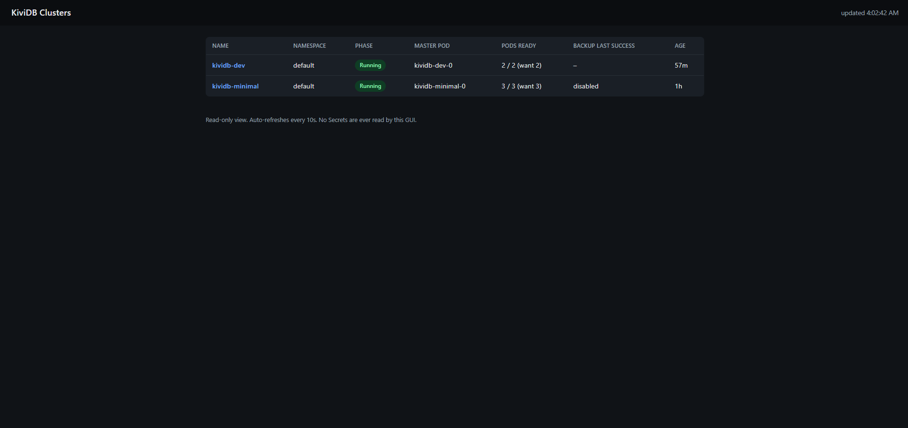

# kividb-operator GUI

<p align="center">
  
</p>

A small, read-only web dashboard for `KividbCluster` objects. It is a
single static Go binary (`cmd/gui`) with the HTML/CSS/JS embedded into it
at build time via `embed.FS` -- there is no Node/npm build step, no CDN
dependency, and the container image ships nothing but the binary itself.

The GUI never reads Secrets. It cannot see ACL passwords, `requirepass`
values, or S3 credentials, and its RBAC (below) is written so that it
literally cannot be granted access to them by accident.

## What it shows

### Dashboard (`/`)

Lists every `KividbCluster` the GUI is allowed to see (all namespaces, or
one namespace if `WATCH_NAMESPACE` is set -- see below), with:

- Name and namespace, linking to that cluster's detail page
- Phase, color-coded: green = `Running`, yellow = `Provisioning` /
  `Degraded` / `FailingOver`, red = `Error`, grey = `Pending`/unknown
- Current master pod name
- Ready/total pod count against the desired count (`spec.replicas + 1`)
- Backup last-success time, derived from the cluster's own
  `KividbSnapshot` history (or "disabled" if `spec.snapshotConfigRef` is
  unset)
- Age

The page fetches `GET /api/clusters` on load and again every 10 seconds
(plain `fetch()` + `setInterval()`, no framework) so it stays current
without a manual refresh.

### Cluster detail (`/clusters/{namespace}/{name}`)

- **Spec summary**: `spec.image` (or the floating default tag if unset,
  labeled accordingly) and `spec.variant`, agent image, port, desired pod count,
  storage size/class, the master/replica Service types, and the names of
  any referenced `KividbConfig`/`KividbAclConfig`/`KividbSnapshotConfig`.
- **Status**: phase, master pod, ready/total pods, observed generation,
  last failover time, age, and (when reachable) the StatefulSet's own
  ready/current/updated replica counts as a cross-check.
- **Backup**: the referenced `KividbSnapshotConfig`'s schedule/retention,
  the backup CronJob's own `suspended`/last-schedule bookkeeping, and the
  cluster's `KividbSnapshot` history (phase, source pod/role, object key,
  size, duration) -- last success/error are derived from that list, not
  from a field on `KividbCluster.status` (there isn't one anymore).
- **Services**: the master and replica Service objects' actual type,
  ClusterIP, external IP/hostname (for `LoadBalancer`), and ports.
- **Pods**: the full `status.pods[]` list (name, role, ready,
  replication offset) enriched with live Pod phase, IP, node name, and
  restart count where that Pod object can still be found.
- **Conditions**: the cluster's `status.conditions[]` (the standard
  `Ready` condition and any others the controller sets).
- **Recent events**: Kubernetes Events whose `involvedObject` is the
  `KividbCluster` itself (fetched via the Events API's
  `involvedObject.kind`/`involvedObject.name` field selector), newest
  first, capped at 50.

This page also fetches `GET /api/clusters/{namespace}/{name}` on load and
every 10 seconds.

### JSON API

- `GET /api/clusters` -- the same rows the dashboard renders.
- `GET /api/clusters/{namespace}/{name}` -- the same data the detail page
  renders. Returns `404` if the cluster doesn't exist, `403` if
  `WATCH_NAMESPACE` is set and the request is for a different namespace.
- `GET /healthz` -- always `200 OK`; used for the container's liveness
  and readiness probes.

## Running it locally

```sh
go run ./cmd/gui
```

This talks to whatever context is current in your kubeconfig (standard
`clientcmd` loading rules: `KUBECONFIG` env var if set, otherwise
`~/.kube/config`). It falls back to that path automatically whenever
`rest.InClusterConfig()` fails, which it always will outside a real pod.
Then open <http://localhost:8090/>.

Useful environment variables:

| Variable         | Default | Meaning                                                        |
|-------------------|---------|-----------------------------------------------------------------|
| `GUI_PORT`        | `8090`  | HTTP listen port.                                               |
| `WATCH_NAMESPACE` | (unset) | Restrict the dashboard and detail API to one namespace. Unset means all namespaces the RBAC below allows. |

Your local user/context needs at least read access to `kividbclusters`,
`pods`, `services`, `events`, `statefulsets`, and `cronjobs` for the pages
to populate fully -- if you're cluster-admin locally (the common case for
`go run` during development) this just works.

## Deploying it

### Option A: the Helm chart (if present)

If `charts/kividb-operator/templates/gui-*.yaml` exists in your checkout,
the chart already wires up a Deployment, ClusterIP Service, and the
GUI's own ServiceAccount/ClusterRole/ClusterRoleBinding as part of
installing `kividb-operator`. Check the chart's `values.yaml` for a
`gui.enabled` (or similarly named) toggle and any image/namespace
overrides, then simply `helm upgrade --install` as usual. No separate
step is needed in that case -- skip Option B.

### Option B: plain YAML (`config/gui/`)

If the Helm chart doesn't (yet) ship GUI templates, apply these three
files directly:

```sh
kubectl create namespace kividb-operator-system --dry-run=client -o yaml | kubectl apply -f -
kubectl apply -f config/gui/rbac.yaml
kubectl apply -f config/gui/deployment.yaml
kubectl apply -f config/gui/service.yaml
```

They assume the `kividb-operator-system` namespace; edit the `namespace:`
field in all three files first if you want to deploy elsewhere (the
`ClusterRoleBinding`'s subject namespace must match the `ServiceAccount`'s
namespace exactly, since that's not inferred from `kubectl apply -n`).

The Deployment references `quay.io/kividbio/kividb-operator-gui:latest`
(built from `Dockerfile.gui` at the repo root) -- override `image:` to
pin a specific tag once release tagging exists.

Once running, reach it with:

```sh
kubectl -n kividb-operator-system port-forward svc/kividb-operator-gui 8090:8090
```

then open <http://localhost:8090/>.

### RBAC this actually needs

`config/gui/rbac.yaml` grants a dedicated `kividb-operator-gui`
ServiceAccount a `ClusterRole` with `get`/`list`/`watch` on:

- `kividbclusters.kividb.io`, `kividbsnapshotconfigs.kividb.io`,
  `kividbsnapshots.kividb.io`
- `pods`, `services`, `events` (core)
- `statefulsets` (`apps`)
- `cronjobs` (`batch`)

and **nothing else** -- in particular, never `secrets` in any API group,
in any of the two clients the Go code builds (see
`cmd/gui/kubeclient.go`). The GUI's code only ever performs `Get`/`List`
calls (it polls every 10s from the browser rather than keeping a
long-lived watch open), so `watch` is granted only as a harmless superset
for future-proofing, not because the current code uses it. Do not bind
this ServiceAccount to the operator manager's own ClusterRole
(`config/rbac/role.yaml`) -- that one also manages `secrets`, which the
GUI must never be able to touch.

## Building the image

```sh
docker build -f Dockerfile.gui -t quay.io/kividbio/kividb-operator-gui:latest .
```

Multi-stage: `golang:1.23-bookworm` builds a fully static
(`CGO_ENABLED=0`) binary, then `gcr.io/distroless/static-debian12:nonroot`
runs it as the distroless image's built-in unprivileged, shell-less user.
The runtime stage needs no CA certificate bundle: in-cluster requests are
authenticated and verified using the CA certificate Kubernetes itself
mounts into the pod (`rest.InClusterConfig()` reads it directly from the
ServiceAccount token projection), not the OS trust store.
