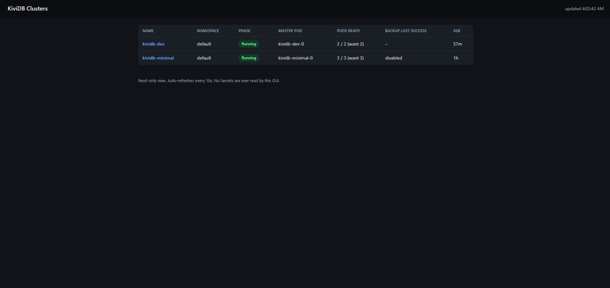

# kividb-operator GUI

<p align="center">
  
</p>

A management web dashboard for `KividbCluster` objects. It is a single
static Go binary (`cmd/gui`) with HTML/CSS/JS embedded via `embed.FS` —
no Node/npm build step.

The GUI never lists Secrets to the browser. ACL passwords and S3
credentials stay out of the UI. Auth credentials for the GUI itself come
from env (`GUI_AUTH_USERNAME` / `GUI_AUTH_PASSWORD`), typically via a
Kubernetes Secret keyRef in the chart — not by the GUI reading Secrets
through the API.

## What it shows

### Dashboard (`/`)

Lists every `KividbCluster` in scope (all namespaces, or
`WATCH_NAMESPACE`), with phase, master, ready/total pods, backup last
success, and age. Polls `GET /api/clusters` every 10s.

### Cluster detail (`/clusters/{namespace}/{name}`)

- Spec / status / backup / services / pods / conditions / events (as in
  earlier releases).
- **Live status** — agent `/status` + memory gauge per pod.
- **Metrics (24h)** — local scraper (every 15s) of agent `/metrics`;
  sparkline charts for memory, clients, repl offset, command rate.
  Kept in memory by default; persisted under `GUI_METRICS_DIR` when set
  (chart: `gui.metrics.persistence.enabled=true`, plus
  `gui.metrics.persistence.storageClass` on clusters without a default
  StorageClass).
- **Operations** — create `KividbDbOps` InPlace restart; list recent
  DbOps.
- **Pod logs** — `GET …/pods/{pod}/logs` (container `kividb` or `agent`).
- **RESP explorer** — `POST …/exec` → agent `POST /exec`. Requires GUI
  Basic auth; refused with 403 when auth is unset.
- **Promote** — switches the master to the chosen pod: the GUI promotes
  it and makes the current master its replica, and the operator then
  moves the `kividb.io/role` label (and so the master Service) and
  re-points the other replicas. Writes that reach the old master in the
  moment between those two steps are not carried over.

Default engine image shown when `spec.image` is empty:
`quay.io/kividbio/kividb:v1.0.4`.

### JSON API

| Method | Path | Notes |
|--------|------|--------|
| GET | `/api/clusters` | Dashboard rows |
| GET | `/api/clusters/{ns}/{name}` | Detail payload |
| GET | `/api/clusters/{ns}/{name}/live` | Per-pod agent status |
| GET | `/api/clusters/{ns}/{name}/metrics?from=&to=` | 24h series (unix ms) |
| GET | `/api/clusters/{ns}/{name}/dbops` | DbOps list |
| POST | `/api/clusters/{ns}/{name}/restart` | Create InPlace restart DbOps |
| POST | `/api/clusters/{ns}/{name}/exec` | RESP command (auth required) |
| GET | `/api/clusters/{ns}/{name}/pods/{pod}/logs` | Pod logs |
| GET | `/healthz` | Liveness (no auth) |

## Auth

Set both `GUI_AUTH_USERNAME` and `GUI_AUTH_PASSWORD` to enable HTTP Basic
auth on all routes except `/healthz`. Chart:

```yaml
gui:
  auth:
    existingSecret: my-gui-auth   # keys: username, password
```

Without auth the GUI is a read-only dashboard: it still serves the read
APIs, and **every write returns 403** — the RESP explorer as well as
restart, scale, promote, snapshot and delete.

Writes are also refused when the request's `Origin` is a different site,
so a page open in the same browser cannot use your saved credentials
against the GUI.

## Running locally

```sh
export GUI_AUTH_USERNAME=admin GUI_AUTH_PASSWORD=dev
# optional: export GUI_METRICS_DIR=/tmp/kividb-gui-metrics
go run ./cmd/gui
```

Open <http://localhost:8090/>.

| Variable | Default | Meaning |
|----------|---------|---------|
| `GUI_PORT` | `8090` | Listen port |
| `WATCH_NAMESPACE` | (unset) | Restrict to one namespace |
| `GUI_AUTH_USERNAME` / `GUI_AUTH_PASSWORD` | unset | Basic auth |
| `GUI_METRICS_DIR` | unset | Persist 24h metrics JSON here |

## Deploying

Helm (`gui.enabled`, default true) creates Deployment, Service, narrow
ClusterRole, optional metrics PVC, and wires auth from
`gui.auth.existingSecret`.

```sh
kubectl create secret generic kividb-gui-auth \
  --from-literal=username=admin --from-literal=password='…' \
  -n kividb-operator-system

helm upgrade --install kividb-operator charts/kividb-operator \
  -n kividb-operator-system --create-namespace \
  --set gui.auth.existingSecret=kividb-gui-auth
```

Plain YAML: `config/gui/` (update RBAC from `config/gui/rbac.yaml`).

Port-forward:

```sh
kubectl -n kividb-operator-system port-forward svc/kividb-operator-gui 8090:8090
```

### RBAC

`get`/`list`/`watch` on clusters, snapshot configs/snapshots, DbOps, pods,
services, events, statefulsets, cronjobs; **`create` on `kividbdbops`**;
**`get` on `pods/log`**. Never `secrets` via the API clients.

## Building the image

```sh
docker build -f Dockerfile.gui -t quay.io/kividbio/kividb-operator-gui:0.4.0 .
```
